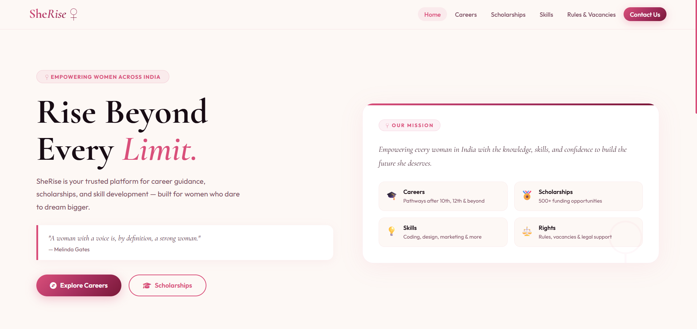

# SheRise

A digital experience about women's strength and empowerment.

## Preview


# 🌸 SheRise – Empowering Women Through Technology

SheRise is a web platform designed to highlight opportunities, resources, and inspiring stories for women.
The goal of this project is to show that **being a woman is not a limitation but a strength.**

This project brings together career guidance, scholarships, skill development, and inspirational stories to help women grow.

---

## ✨ Features

- 🌟 Inspirational stories of great women
- 🎓 Scholarship resources for education
- 💼 Career guidance and opportunities
- 🧠 Skill development resources
- 📜 Information about government schemes and rules

The website focuses on **awareness, empowerment, and opportunity**.

---

## 🛠 Tech Stack

- HTML5
- CSS3
- JavaScript
- Font Awesome Icons
- Google Fonts

---

## 🎯 Project Motivation

While scrolling through the news, I often came across painful stories of violence and discrimination against women.
Instead of only feeling sad about it, I wanted to create something meaningful.

**SheRise** is a small step towards building a space that:

- celebrates powerful women
- provides helpful resources
- encourages growth and independence

Technology should not only solve problems — it should **uplift people.**

---

## 🚀 How to Run the Project

1. Clone the repository

```bash
git clone https://github.com/thanusrithota2007-ui/sherise.git
```

2. Open the folder

3. Run the project by opening

```
index.html
```

in your browser.

---

## 🌍 Future Improvements

- Women safety helpline section
- Community stories section
- Interactive chatbot for guidance
- Mobile responsive improvements
- Resource recommendation system

---

## 👩‍💻 Author

**Thanusri**
CSE (Data Science) Student
Passionate about technology, storytelling, and building meaningful digital products.

---

## 🌟 Message

> "Empowered women empower the world."